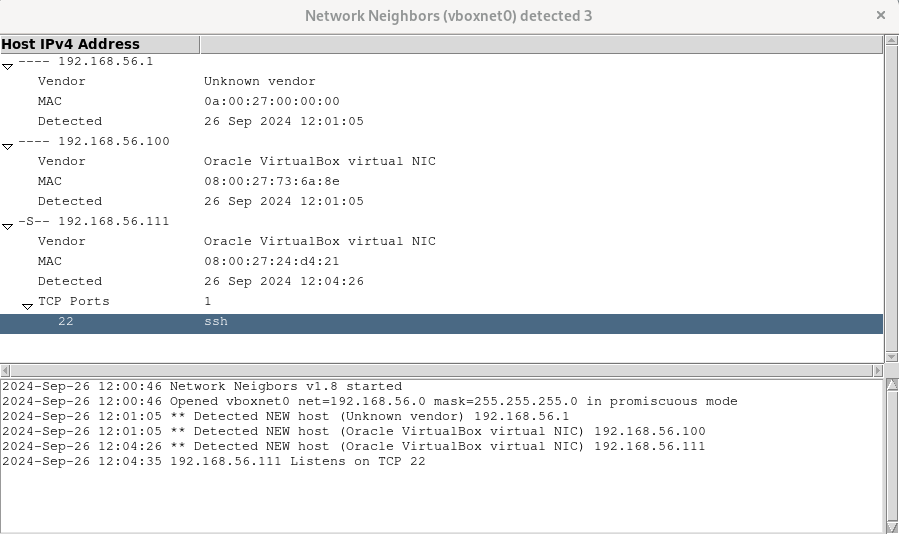

# NetNeighbors 
## ©️ 2016-2024 Claes M Nyberg, cmn@fuzzpoint.com
---

---
## -=[ What is this?
    This is a tool for displaying the active network neighbors on the same 
    broadcast domain. It has been developed on Ubuntu Linux 16 with Python 2.7 in 2016
    and now ported to Python 3 and tested on Ubuntu 22

    Every time it is run a sqlite3 database is created in the current directory.
    It is named <interface>.sqlite. Any existing database will be overwritten.

    A log file named netneighbors.log (that is appended on each run), 
    is created in the same directory,

###    -=[ Required Python libraries
    pcapy
    tk
    netaddr

###    -=[ Ubuntu 22 required installations
    apt-get install python3-netaddr
    apt-get install python3-tk
    apt-get install python3-pcapy

    If you are running Gnome Shell and want to
    start NetNeighbors from Gnome, take a look
    in ./Gnome-Shell

###    -=[ Credits
    http://www.nmap.org
        MAC vendors database is ripped from nmap
        TCP services database is based of the one from nmap
    

## -=[ Running
    You need root privilegees to run this program since it listens for 
    network traffic in promiscuous mode. 
    
    Usage: ./NetNeighbors.py <iface> [Options]
    Options:
          -d --dbFile <file>  - The database file to write
          -g --noGUI          - Disable GUI
          -h --help           - This help
          -l --logFile <file> - The log file to use
          -v --verbose        - Be verbose, repeat to increase

### -=[ Example:
    ./NetNeighbors.py wifi0

    Once the program is up and running a GUI is displayed.
    Detected hosts will show up in a tree view.
    Expanding a node shows more information.

    The IPv4 address of every host has a set of flags prepended to it:
        '-'  - Means that nothing has been detected
        'G'  - The host is detected as a gateway
        'S'  - The host is detected as a server (has listening ports)
        'I'  - The host communicates with Internet
        'A'  - User agent string has been collected from the host

    The IPv4 address of a host with discovered open TCP ports
    has the detected listening ports appended to it's tree.

    Selecting a row and right clicking shows a popup menu.
    If the selected row is an IP address:
        Copy                       - Copy text on row into clipboard
        Set host description       - Add a descriptive string for the host
        Clear host description     - Delete any description
        Remove and re-detect host  - Remove host from list and detect again
        Delete and ignore host     - Delete and ignore host

    If the selected row is not an IP address
        Copy                       - Copy text on row into clipboard

## -=[ Limitations
    There are so much more to do!
    icons, sorting etc.

## -=[ Bugs
    No bugs are known to the author at this point, please report 
    them to cmn@fuzzpoint.com.

## -=[ Changelog
    2.0
    - Ported to Python 3

    1.8
    - Re-packed everything for shared release

    1.7
    - Fixed some bugs in the popup menues

    1.6 
    - Minor bug fixes
    - Fixed the log window flickering by removing 'disabled'

    1.5
    - Fixed line numbers in Technique.txt

    1.4
    - Added log window to GUI
    - Added Ubuntu directory for installation to Gnome Shell

    1.3
    - Changed som printed output in Sniff.py
    - Removed duplicated thread init in Sniff.py
    - Reorganized some code
    - Added ToDo.txt
    - Removed coloring for servers
    - Added Internet access detection
    - Added host flags 
        G - Gateway
        S - Server
        I - Internet access
        A - User Agent 

    1.2
    - Added Changelog.txt :)
    - Added som ignored subnets into Sniff.py
    - Added ipv4InSubnets in Utils.py
    - Added tests to UnitTests.py

